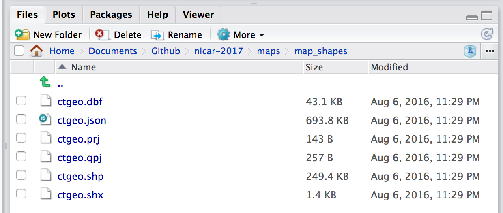

This tutorial is an introduction to analyzing spatial data in R, specifically through map-making with R's 'base' graphics and ggplot2 for static maps. You'll be introduced to the basics of using R as a fast and powerful command-line Geographical Information System (GIS). We'll also use the really fun Census API package. Seriously, it is a life-changer. 

No prior knowledge is necessary to follow along, but an understanding of how pipes (%>%) and dplyr works will help.

**Other mapping tutorials**

* Programatically generating maps and GIFs with shape files [[link](shapes-and-gifs.html)]
* Interactive maps with Leaflet in R [[link](leaflet-r.html)]


# Geolocating addresses in R


We're going to start with geolocating municipal police stations in Connecticut.

We'll be using the [`ggmap` package](https://github.com/dkahle/ggmap) for a lot of functions, starting with geolocating addresses with Google Maps.

```{r loading_packages, warning=F, message=F}
library(tidyverse)
library(ggmap)
library(DT)
library(knitr)
```

```{r geolocating}
stations <- read.csv("data/Police_Departments.csv", stringsAsFactors=F)
datatable(head(stations))
```

----

We need a single column for addresses, so we'll concatenate a few columns.

```{r geolocating2, eval=F}
stations$location <- paste0(stations$ADDRESS, ", ", stations$CITY, ", CT ", stations$ZIP)

# This function geocodes a location (find latitude and longitude) using the Google Maps API
geo <- geocode(location = stations$location, output="latlon", source="google")
```

```{r geo}
# If it's taking too long, you can cancel and load the output by uncommenting the line below
geo <- read.csv("data/geo_stations.csv")

# Bringing over the longitude and latitude data
stations$lon <- geo$lon
stations$lat <- geo$lat
```

# Shapefiles with ggplot2

We could plot the points using leaflet and with shapefiles brought in via the Tigris package, but we'll do it the old-fashioned way.

First, we'll bring in our own shapefile and plot it as a static image.

We need to put all our shapefiles in a directory we can find later.



The working directory is `maps` and I've placed the **ctgeo** shapefiles into the `map_shapes` folder.

Now, I can load it in with the `readOGR` function and display it with `plot()`.

First, we'll need to load the [`rgdal` package](https://cran.r-project.org/web/packages/rgdal/rgdal.pdf).

```{r geo_map_basic, fig.width=8, fig.height=4, warning=F, message=F}
# install.packages("rgdal")
library(rgdal)

# dsn is the folder the shape files are in. layer is the name of the file.
towns <- readOGR(dsn="map_shapes", layer="ctgeo")

plot(towns)
```

----

Simple.

Now, let's add the police station locations as a layer using `plot()` again but identifying the color this time using `add=TRUE`.

# Converting to spatial points


```{r geo_map_basic_points, fig.width=8, fig.height=4, warning=F, message=F}
# first, we have to isolate the coordinates of the police stations
# and let R know that these are spatial points

coords <- stations[c("lon", "lat")]

# Making sure we are working with rows that don't have any blanks
coords <- coords[complete.cases(coords),]

# Letting R know that these are specifically spatial coordinates
sp <- SpatialPoints(coords)


plot(towns)
plot(sp, col="red", add=TRUE)
```

Congrats, this is the **base** method of plotting spatial data.

But we're going to try it with ggplot2 because there are nice and easy features with it.

# Plotting points with ggplot2

```{r plotting_ggplot2, fig.width=8, fig.height=4, warning=F, message=F}
# First, ggplot2 works with dataframes
# So, we need to convert the towns shapefile into a dataframe with the fortify function
# Also, we'll make sure the region option is set to a unique name column if we want to join data later

towns_fortify <- fortify(towns, region="NAME10")

gg <- ggplot()
gg <- gg + geom_polygon(data=towns_fortify, aes(x=long, y=lat, group=group, fill=NA), color = "black", fill=NA, size=0.5) 
gg <- gg + geom_point(data=stations, aes(x=lon, y=lat, color="red"))
gg <- gg +  coord_map()
gg
```

----

# Styling maps with ggplot2

Alright, let's clean it up a bit.

We don't need the grid or the background or the axis or even the legend.

We also need a headline and source.


```{r plotting_ggplot3, fig.width=8, fig.height=5, warning=F, message=F}
gg <- ggplot()
gg <- gg + geom_polygon(data=towns_fortify, aes(x=long, y=lat, group=group, fill=NA), color = "black", fill=NA, size=0.5) 
gg <- gg + geom_point(data=stations, aes(x=lon, y=lat, color="red"))
gg <- gg +  coord_map()
gg <- gg + labs(x=NULL, y=NULL, 
                  title="Police stations in Connecticut",
                  subtitle=NULL,
                  caption="Source: data.ct.gov")
  gg <- gg + theme(plot.title=element_text(face="bold", family="Arial", size=13))
  gg <- gg + theme(plot.caption=element_text(face="bold", family="Arial", size=7, color="gray", margin=margin(t=10, r=80)))
  gg <- gg + theme(legend.position="none")
  gg <- gg + theme(axis.line =  element_blank(),
                   axis.text =  element_blank(),
                   axis.ticks =  element_blank(),
                   panel.grid.major = element_blank(),
                   panel.grid.minor = element_blank(),
                   panel.border = element_blank(),
                   panel.background = element_blank()) 
print(gg)
```

From here, you could export this as a **png** or **svg** and edit it further with Adobe Illustrator.

To do so, use the command `ggsave(file="filename.svg", plot=gg, width=10, height=8)`

But let's move on and look at traffic stops that police conducted in a single town: Hamden.

Let's plot out the stops in relation to the Census tracts of the town.

```{r stops_import, warning=F, message=F}
# Bring in the data
stops <- read.csv("data/hamden_stops.csv", stringsAsFactors=FALSE)
```

There were nearly 5,500 traffic stops in Hamden in 2015. 

----


----

```{r traffic_stops_hamden_points, fig.width=8, fig.height=5, warning=F, message=F}

# Check and eliminate the rows that don't have location information 
stops <- stops[!is.na(stops$InterventionLocationLatitude),]
stops <- subset(stops, InterventionLocationLatitude!=0)

# Bring in the shape files for census tracts

# map_shapes is the folder the shape files are in. layer is the name of the file.
towntracts <- readOGR(dsn="map_shapes", layer="hamden_census_tracts")

# creating a copy
towntracts_only <- towntracts

# turn the shapefile into a dataframe that can be worked on in R

towntracts <- fortify(towntracts, region="GEOID10")

# So now we have towntracts and towntracts_only
# What's the difference? towntracts is a dataframe and can be seen easily

gg <- ggplot()
gg <- gg + geom_polygon(data=towntracts, aes(x=long, y=lat, group=group, fill=NA), color = "black", fill=NA, size=0.5) 
gg <- gg + geom_point(data=stops, aes(x=InterventionLocationLongitude, y=InterventionLocationLatitude, color="red"))
gg <- gg +  coord_map()
gg <- gg + labs(x=NULL, y=NULL, 
                  title="Traffic stops in Hamden",
                  subtitle=NULL,
                  caption="Source: data.ct.gov")
  gg <- gg + theme(plot.title=element_text(face="bold", family="Arial", size=13))
  gg <- gg + theme(plot.caption=element_text(face="bold", family="Arial", size=7, color="gray", margin=margin(t=10, r=80)))
  gg <- gg + theme(legend.position="none")
  gg <- gg + theme(axis.line =  element_blank(),
                   axis.text =  element_blank(),
                   axis.ticks =  element_blank(),
                   panel.grid.major = element_blank(),
                   panel.grid.minor = element_blank(),
                   panel.border = element_blank(),
                   panel.background = element_blank()) 
print(gg)


```

----

# Deeper analysis

If you have a data set with latitude and longitude information, it’s easy to just throw it on a map with a dot for every instance. 

But what would that tell you? You see the intensity of the cluster of dots over the area but that’s it. 

If there’s no context or explanation it’s a flashy visualization and that’s it.

# Heat map

One way is to visualize the distribution of stops.

We'll use the `stat_density2d` function within ggplot2 and use `coord_map` and `xlim` and `ylim` to set the boundaries on the map so it's zoomed in more.

```{r density1, fig.width=8, fig.height=5, warning=F, message=F}

gg <- ggplot()
gg <- gg + stat_density2d(data=stops, show.legend=F, aes(x=InterventionLocationLongitude, y=InterventionLocationLatitude, fill=..level.., alpha=..level..), geom="polygon", size=2, bins=10)
gg <- gg + geom_polygon(data=towntracts, aes(x=long, y=lat, group=group, fill=NA), color = "black", fill=NA, size=0.5) 
gg <- gg + scale_fill_gradient(low="deepskyblue2", high="firebrick1", name="Distribution")
gg <- gg +  coord_map("polyconic", xlim=c(-73.067649, -72.743739), ylim=c(41.280972, 41.485011)) 
gg <- gg + labs(x=NULL, y=NULL, 
                  title="Traffic stops distribution in Hamden",
                  subtitle=NULL,
                  caption="Source: data.ct.gov")
gg
```

That's interesting.

What's nice about ggplot2, is the functionality called facets, which allows the construction of small multiples based on factors.

Let's try this again but faceted by race.


```{r density2, fig.width=8, fig.height=5, warning=F, message=F}
# Cleaning up for Hispanic distinction
stops$race <- ifelse(stops$SubjectEthnicityCode=="H", "H", stops$SubjectRaceCode)
  
gg <- ggplot()
gg <- gg + stat_density2d(data=stops, show.legend=F, aes(x=InterventionLocationLongitude, y=InterventionLocationLatitude, fill=..level.., alpha=..level..), geom="polygon", size=2, bins=10)
gg <- gg + geom_polygon(data=towntracts, aes(x=long, y=lat, group=group, fill=NA), color = "black", fill=NA, size=0.5) 
gg <- gg + scale_fill_gradient(low="deepskyblue2", high="firebrick1", name="Distribution")
gg <- gg +  coord_map("polyconic", xlim=c(-73.067649, -72.743739), ylim=c(41.280972, 41.485011)) 

# This is the line that's being added
gg <- gg + facet_wrap(~race)
gg <- gg + labs(x=NULL, y=NULL, 
                  title="Traffic stops distribution in Hamden by race",
                  subtitle=NULL,
                  caption="Source: data.ct.gov")
gg
```

Interesting. 

But it still doesn't tell the full story because it's still a bit misleading.

Here's what I mean.

```{r table}
table(stops$race)
```

The distribution is comparitive to its own group and not as a whole.

Gotta go deeper.

Let's look at which neighborhoods police tend to pull people over more often and compare it to demographic data from the Census.

So we need to count up the instances with the `over()` function.

# Points in a polygon 

```{r points_in_a_polygon, warning=F, message=F}
# We only need the columns with the latitude and longitude
coords <- stops[c("InterventionLocationLongitude", "InterventionLocationLatitude")]

# Letting R know that these are specifically spatial coordinates
sp <- SpatialPoints(coords)

# Applying projections to the coordinates so they match up with the shapefile we're joining them with
# More projections information http://trac.osgeo.org/proj/wiki/GenParms 
proj4string(sp) <- "+proj=longlat +datum=WGS84 +no_defs +ellps=WGS84 +towgs84=0,0,0"
proj4string(sp)


# Calculating points in a polygon
# Using the over function, the first option is the points and the second is the polygons shapefile
by_tract <- over(sp, towntracts_only)

datatable(by_tract)

```

----

What just happened: Every point in the original stops list now has a corresponding census tract.

Now, we can summarize the data by count and merge it back to the shape file and visualize it.

```{r points_in_a_polygon2, warning=F, message=F}

by_tract <- by_tract %>%
  group_by(GEOID10) %>%
  summarise(total=n())

# Get rid of the census tracts with no data
by_tract <- by_tract[!is.na(by_tract$GEOID10),]

kable(head(by_tract,5))

# Rename the columns of this datframe so it can be joined to future data
colnames(by_tract) <- c("id", "total")

# Changing the GEOID number to character so it can be joined to future data
by_tract$id <- as.character(by_tract$id)
```

----

Alright, we have the tract ID, but we need to bring in a relationship file that matches a census tract ID to town names (because Hamden police sometimes stopped people outside of city limits).

----

```{r knitr}
library(knitr)
# Bring in a dataframe that has matches census tract ID numbers to town names
tracts2towns <- read.csv("data/tracts_to_towns.csv", stringsAsFactors=FALSE)

kable(head(tracts2towns, 5))


# Changing the column names so it can be joined to the by_tract dataframe
colnames(tracts2towns) <- c("id", "town_name")

# Changing the GEOID number to character so it can be joined to the by_tract dataframe
tracts2towns$id <- as.character(tracts2towns$id)

# Adding a 0 to the front of the GEOID string because it was originally left out when it was imported
tracts2towns$id <- paste0("0", tracts2towns$id)

# Bringing in a library to deal with strings
library(stringr)

# Eliminating leading and trailing white space just in case
tracts2towns$town_name <- str_trim(tracts2towns$town_name)

# Joining the by_tract dataframe to the tracts2towns dataframe

by_tract <- left_join(by_tract, tracts2towns)
```

----

That was a lot of work, but now we can tell for sure when Hamden police overextended themselves.

# Making a choropleth

A choropleth map is a thematic map in which areas are shaded or patterned in proportion to the measurement of the statistical variable being displayed on the map. In this instance, it’s total traffic stops.

We'll use the [`scales` package](https://cran.r-project.org/web/packages/scales/scales.pdf) for simplified color schemes.

```{r choropleth1, fig.width=8, fig.height=5, warning=F, message=F}
# Join the by_tract points to polygon dataframe to the original census tracts dataframe
total_map <- left_join(towntracts, by_tract)

library(scales)

hamden_ts <- ggplot() 
hamden_ts <- hamden_ts +  geom_polygon(data = total_map, aes(x=long, y=lat, group=group, fill=total), color = "black", size=0.2) 
hamden_ts <- hamden_ts + geom_polygon(data = total_map, aes(x=long, y=lat, group=group, fill=total), color = "black", size=0.2) 
hamden_ts <- hamden_ts + coord_map() 
hamden_ts <- hamden_ts + scale_fill_distiller(type="seq", trans="reverse", palette = "Reds", breaks=pretty_breaks(n=10)) 
hamden_ts <- hamden_ts + theme_nothing(legend=TRUE) 
hamden_ts <- hamden_ts + labs(title="Where Hamden police conduct traffic stops", fill="")
print(hamden_ts)

```

----

Excellent. This is a great start but we have a lot of gray tracts.

Let’s try again but without the gray.

```{r choropleth2, fig.width=8, fig.height=5, warning=F, message=F}

# Filter out the tracts with NA in the total column

total_map <- subset(total_map, !is.na(total))

hamden_ts <- ggplot() 
hamden_ts <- hamden_ts +  geom_polygon(data = total_map, aes(x=long, y=lat, group=group, fill=total), color = "black", size=0.2)
hamden_ts <- hamden_ts +  coord_map()
hamden_ts <- hamden_ts +  scale_fill_distiller(type="seq", trans="reverse", palette = "Reds", breaks=pretty_breaks(n=10))
hamden_ts <- hamden_ts +  theme_nothing(legend=TRUE)
hamden_ts <- hamden_ts +  labs(title="Where Hamden police conduct traffic stops", fill="")
print(hamden_ts)


```

----

Much better. But we’re still unclear which part is Hamden and which are parts of other towns.

We need to bring in an additional shape file— town borders.

```{r town_borders, fig.width=8, fig.height=5, warning=F, message=F}
# bringing in another shape file of all connecticut towns
townborders <- readOGR(dsn="map_shapes", layer="ctgeo")
townborders_only <- townborders
townborders<- fortify(townborders, region="NAME10")

# Subset the town borders to just Hamden since that's the department we're looking at
town_borders <- subset(townborders, id=="Hamden")

hamden_ts <- ggplot() 
hamden_ts <- hamden_ts +  geom_polygon(data = total_map, aes(x=long, y=lat, group=group, fill=total), color = "black", size=0.2) 
hamden_ts <- hamden_ts +  geom_polygon(data = town_borders, aes(x=long, y=lat, group=group, fill=total), color = "black", fill=NA, size=0.5) 
hamden_ts <- hamden_ts +  coord_map() 
hamden_ts <- hamden_ts +  scale_fill_distiller(type="seq", trans="reverse", palette = "Reds", breaks=pretty_breaks(n=10)) 
hamden_ts <- hamden_ts +  theme_nothing(legend=TRUE) 
hamden_ts <- hamden_ts +  labs(title="Where Hamden police conduct traffic stops", fill="")
print(hamden_ts)

```

That additional line of `geom_polygon()` code layered on the Hamden town borders. 

So now we can see which tracts fell outside.

# Analyzing the data

Before we move on, we need to also calculate the number of minority stops in Hamden census tracts.

```{r analysis}
# Add a column to original stops dataset identifying a driver as white or a minority
stops$ethnicity <- ifelse(((stops$SubjectRaceCode ==  "W") & (stops$SubjectEthnicityCode =="N")), "White", "Minority")

# Create a dataframe of only minority stops
coords <- subset(stops, ethnicity=="Minority")
coords <- coords[c("InterventionLocationLongitude", "InterventionLocationLatitude")]
coords <- coords[complete.cases(coords),]
sp <- SpatialPoints(coords)
proj4string(sp) <- "+proj=longlat +datum=WGS84 +no_defs +ellps=WGS84 +towgs84=0,0,0"
proj4string(sp)

# Points in a polygon for minorities who were stopped
m_tract <- over(sp, towntracts_only)

m_tract <- m_tract %>%
  group_by(GEOID10) %>%
  summarise(minority=n())

m_tract <- m_tract[!is.na(m_tract$GEOID10),]
colnames(m_tract) <- c("id", "minority")
m_tract$id <- as.character(m_tract$id)

joined_tracts <- left_join(by_tract, m_tract)

# Calculating percent of stops that were minorities

joined_tracts$minority_p <- round(joined_tracts$minority/joined_tracts$total*100,2)
```
To summarize the code above, we ran the over() function once more, but to a subset of the stops data that was specifically of minority drivers.

Then we figured out the percent of minority drivers stopped per census tract.

Here's a sample of the results.

```{r kable_table, warning=F, message=F}
kable(head(joined_tracts))
```

----

# Joining with census data

We’ll be using the [censusapi](https://github.com/hrecht/censusapi) package from Hanna Recht. It has excellent [documentation](http://urbaninstitute.github.io/R-Trainings/accesing-census-apis/presentation/index.html).

```{r census_api, warning=F, message=F}
# If you do not yet have the censusapi package installed, uncomment the lines below and run them.

#install.packages("devtools")
#devtools::install_github("hrecht/censusapi")
library("censusapi")

# Loading my census key from an external script
source("key.R")

# Replace census_key below with "your_own_key_whatever_it_is"
# Apply for one here http://api.census.gov/data/key_signup.html

race_tracts <- getCensus(name="acs5",
    vintage=2014,
    key=census_key,
    vars=c("NAME", "B02001_001E", "B02001_002E"),
    region="tract:*", regionin="state:09")

# read.csv("race_tracts.csv", stringsAsFactors=F)
kable(head(race_tracts))
```

----

### What did we just do?

We pulled the following population data for all census tracts in state 09, which is Connecticut.

* B02001_001E - Total
* B02001_002E - White alone

This is what the `getCensus()` function imported. We now know total and white population per census tract.

----

# Calculating geo disparity

Next, we bring the two dataframes (traffic tickets by census tract and population by census tract) together so we can calculate disparity.

```{r census_cleanup, warning=F, message=F}
# ok, let's clean this up
race_tracts$NAME <- NULL

# Creating a new column for the GEOID that can be joined with the dataframe we already have
race_tracts$id <- paste0(race_tracts$state, race_tracts$county, race_tracts$tract)

# Renaming the column names for clarity
colnames(race_tracts) <- c("state_code", "county_code", "tract_code", "total_pop", "white_pop", "id")

# Determining the minority population by subtracting the white population from the total
race_tracts$minority_pop <- race_tracts$total_pop - race_tracts$white_pop

# Now figuring out the percent makeup of each census tract
race_tracts$white_pop_p <- round(race_tracts$white_pop/race_tracts$total_pop*100,2)
race_tracts$minority_pop_p <- round(race_tracts$minority_pop/race_tracts$total_pop*100,2)

# Joining the two datframes
joined_tracts <- left_join(joined_tracts, race_tracts)

# Calculating disparity between minority traffic stops and population

joined_tracts$min_disp <- joined_tracts$minority_p - joined_tracts$minority_pop_p

kable(head(joined_tracts))
```

----

# Visualizing geo disparity

Finally, we can visualize this disparity.

This time, we’ll use a diverging color palette, **PuOr**.

```{r new_map1, fig.width=8, fig.height=5, warning=F, message=F}
mapping_disparity <- left_join(towntracts, joined_tracts)
mapping_disparity <- subset(mapping_disparity, !is.na(min_disp))


pm_ct <- ggplot() 
pm_ct <- pm_ct + geom_polygon(data = mapping_disparity, aes(x=long, y=lat, group=group, fill=min_disp/100), color="white", size=.25)
pm_ct <- pm_ct + geom_polygon(data = town_borders, aes(x=long, y=lat, group=group), fill=NA, color = "black", size=0.5)
pm_ct <- pm_ct + coord_map() 
pm_ct <- pm_ct + scale_fill_distiller(type="seq", trans="reverse", palette = "PuOr", label=percent, breaks=pretty_breaks(n=10), name="Gap") 
pm_ct <- pm_ct + theme_nothing(legend=TRUE) 
pm_ct <- pm_ct + labs(x=NULL, y=NULL, title="Hamden: Minority traffic stops versus population")
pm_ct <- pm_ct + theme(text = element_text(size=15))
pm_ct <- pm_ct + theme(plot.title=element_text(face="bold", hjust=.4))
pm_ct <- pm_ct + theme(plot.subtitle=element_text(face="italic", size=9, margin=margin(l=20)))
pm_ct <- pm_ct + theme(plot.caption=element_text(size=12, margin=margin(t=12), color="#7a7d7e", hjust=0))
pm_ct <- pm_ct + theme(legend.key.size = unit(1, "cm"))
print(pm_ct)
```

----

# Add annotations to graphic

We'll use the `annotate()` function with a combination of segments, points, and text.

```{r new_map2, fig.width=8, fig.height=5, warning=F, message=F}
pm_ct <- ggplot() 
pm_ct <- pm_ct + geom_polygon(data = mapping_disparity, aes(x=long, y=lat, group=group, fill=min_disp/100), color="white", size=.25)
pm_ct <- pm_ct + geom_polygon(data = town_borders, aes(x=long, y=lat, group=group), fill=NA, color = "black", size=0.5)
pm_ct <- pm_ct + coord_map() 
pm_ct <- pm_ct + scale_fill_distiller(type="seq", trans="reverse", palette = "PuOr", label=percent, breaks=pretty_breaks(n=10), name="Gap") 
pm_ct <- pm_ct + theme_nothing(legend=TRUE) 
pm_ct <- pm_ct + labs(x=NULL, y=NULL, title="Hamden: Minority traffic stops versus population")
pm_ct <- pm_ct + theme(text = element_text(size=15))
pm_ct <- pm_ct + theme(plot.title=element_text(face="bold", hjust=.4))
pm_ct <- pm_ct + theme(plot.subtitle=element_text(face="italic", size=9, margin=margin(l=20)))
pm_ct <- pm_ct + theme(plot.caption=element_text(size=12, margin=margin(t=12), color="#7a7d7e", hjust=0))
pm_ct <- pm_ct + theme(legend.key.size = unit(1, "cm"))

# Annotations 

pm_ct <- pm_ct + annotate("segment", x = -72.93, xend = -72.87, y = 41.325, yend = 41.325, colour = "lightblue", size=.5) 
pm_ct <- pm_ct + annotate("point", x = -72.93, y = 41.325, colour = "lightblue", size = 2) 
pm_ct <- pm_ct + annotate("text", x = -72.85, y = 41.325, label = "New Haven", size=5, colour="gray30") 
pm_ct <- pm_ct + annotate("segment", x = -72.89, xend = -72.86, y = 41.375, yend = 41.375, colour = "lightblue", size=.5) 
pm_ct <- pm_ct + annotate("point", x = -72.89, y = 41.375, colour = "lightblue", size = 2) 
pm_ct <- pm_ct + annotate("text", x = -72.845, y = 41.375, label = "Hamden", size=5, colour="gray30") 
pm_ct <- pm_ct + annotate("point", x = -72.83, y = 41.375, colour="white", size=.2) 

print(pm_ct)

```

Beautiful.

Congratulations, you’ve made it.

# Exporting as svg or geojson

Once again, you can export as a png or svg file. 

Just type `ggsave(file="filename.svg", plot=pm_ct, width=10, height=8)`

Or you can save the modified shapefile as a geojson file with the [**geojsonio**](https://cran.r-project.org/web/packages/geojsonio/index.html) package.

```{r export_geo, warning=F, message=F, eval=F}
# install.packages("geojsonio")
library(geojsonio)

mapping_disparity_gj <- geojson_json(mapping_disparity)
geojson_write(mapping_disparity_gj)
```


It looks like this above.

You can also simplify the shape if you're dealing with a big file, but we won't get into that now. Here are [some instructions](https://blog.exploratory.io/creating-geojson-out-of-shapefile-in-r-40bc0005857d#.ewza8rcy2) if you're curious, though.

We can see the census tracts bordering the town of New Haven has the largest disparities. This means there are large gaps between the percent of minorities pulled over in those areas compared to the percent of minorities who actually live there. New Haven has a much higher percent minority population than Hamden and police officers tend to focus their traffic enforcement by there.

You can also create a quick chart to make the relationship between population and stops more obvious.

# Slope graph for fun

```{r chart, fig.height=7, fig.width=7, warning=F, message=F}
joined_tracts2 <- subset(joined_tracts, !is.na(minority_p))
sb1 <- select(joined_tracts2, id, minority_pop_p)
colnames(sb1) <- c("id", "percent")
sb1$category <- "Minority population"
sb2 <- select(joined_tracts2, id, minority_p)
colnames(sb2) <- c("id", "percent")
sb2$category <- "Minorities stopped"

sb3 <- rbind(sb1, sb2)

sp <- ggplot(sb3) 
sp <- sp + geom_line(aes(x=as.factor(category), y=percent, group=id), size=1)
sp <- sp + geom_point(aes(x=as.factor(category), y=percent), size=3)
sp <- sp + theme_minimal()
sp <- sp + scale_y_log10()
sp <- sp +geom_text(data = subset(sb3, category=="Minority population"), 
            aes(x = as.factor(category), y = percent, label = percent), 
            size = 3, hjust = -.7)
sp <- sp +  geom_text(data = subset(sb3, category=="Minorities stopped"), 
            aes(x = as.factor(category), y = percent, label = percent), 
            size = 3, hjust = 1.5) 
sp <- sp+ theme(legend.position = "none", 
        panel.grid.major.y = element_blank(),
        panel.grid.minor.y = element_blank(),
        panel.grid.major.x = element_blank(), 
        axis.ticks.y = element_blank(),
        axis.ticks.x = element_blank(), 
        axis.title.y = element_blank(), 
        axis.text.y = element_blank(), 
        plot.title = element_text(size = 18))  
sp <- sp + ggtitle("Stops in neighborhoods versus residents in Hamden")
sp <- sp + xlab("")
sp
```

**Next steps?**

Play around with Census U.S. gazetteer data

* [bhaskarvk.github.io/usgazetteer](https://bhaskarvk.github.io/usgazetteer/)
* What's a gazetteer? It's a geographical index or dictionary. This one's from [the Census](https://www.census.gov/geo/maps-data/data/gazetteer.html)

Forecasting gentrification with R - [link](http://urbanspatialanalysis.com/dataviz-tutorial-mapping-san-francisco-home-prices-using-r/)